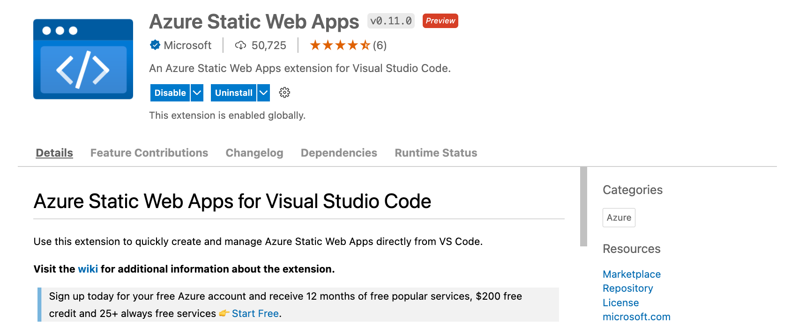

# Build a Resume with React and Static Web Apps

## Objectives

 * Build a resume with React
 * Deploy the resume to Static Web Apps
 * Dive into the code and see how it works
 * Refactor code for API
 * Customize contents for Resume

---

## 1. Scaffold it
---

### 1.1 Create-React-App

Follow [this tutorial](https://create-react-app.dev/docs/getting-started) for a basic React app. This is one of the most common ways to create your basic React app and see that it works.

```
npx create-react-app my-resume
```

The output will end something like this:

```
...
...
Success! Created my-resume at /Users/nitya/Documents/GitHub/nitya/react-resume-swa/my-resume
Inside that directory, you can run several commands:

  npm start
    Starts the development server.

  npm run build
    Bundles the app into static files for production.

  npm test
    Starts the test runner.

  npm run eject
    Removes this tool and copies build dependencies, configuration files
    and scripts into the app directory. If you do this, you can’t go back!

We suggest that you begin by typing:

  cd my-resume
  npm start
```

---

### 1.2. Preview This App

So let's do that and see what the default app looks like:

```
cd my-resume
npm start

...
Starting the Development Server
Compiled successfully!

You can now view my-resume in the browser.

  Local:            http://localhost:3000
  On Your Network:  http://192.168.86.244:3000

Note that the development build is not optimized.
To create a production build, use npm run build.

webpack compiled successfully
```

`🏁 #1` | **This is what you get**


---

## 2. Deploy to Static Web Apps

---

We'll follow [this tutorial](https://docs.microsoft.com/en-us/azure/static-web-apps/getting-started?tabs=react) which shows you how to use the [Azure Static Web Apps Visual Studio Code Extension](https://marketplace.visualstudio.com/items?itemName=ms-azuretools.vscode-azurestaticwebapps) to deploy _any_ React app to Azure. 

 * **This is an IDE-based approach** where you can do all your work in one place - in this case, inside Visual Studio Code (IDE). This is the approach we're taking today.
 * **You may prefer a CLI-based approach** where you do everything with the command-line. The new [Azure Static Web Apps CLI](aka.ms/swa/cli-local-development) is a good option here - we may look at that later.

---

### 2.1 Install the VS Code Extension

If you are already a VS Code user, there are a couple of ways to do this. 

 * Install it from inside VS Code [as described here](https://docs.microsoft.com/en-us/azure/static-web-apps/getting-started?tabs=react#install-azure-static-web-apps-extension) OR
 * Visit the [extension website](https://marketplace.visualstudio.com/items?itemName=ms-azuretools.vscode-azurestaticwebapps) and click `Install`- it should automatically launch VS Code for you and complete that workflow.

I've already installed this in the past, so when I take option 1 above - it launches VS Code to **this page** and shows me that the extension is active.



Want to learn more about how you can develop/debug Azure Static Web Apps with VS Code? [Read this article](https://www.azurestaticwebapps.dev/blog/devtools-vscode) fron the #30DaysOfSWA series.

---