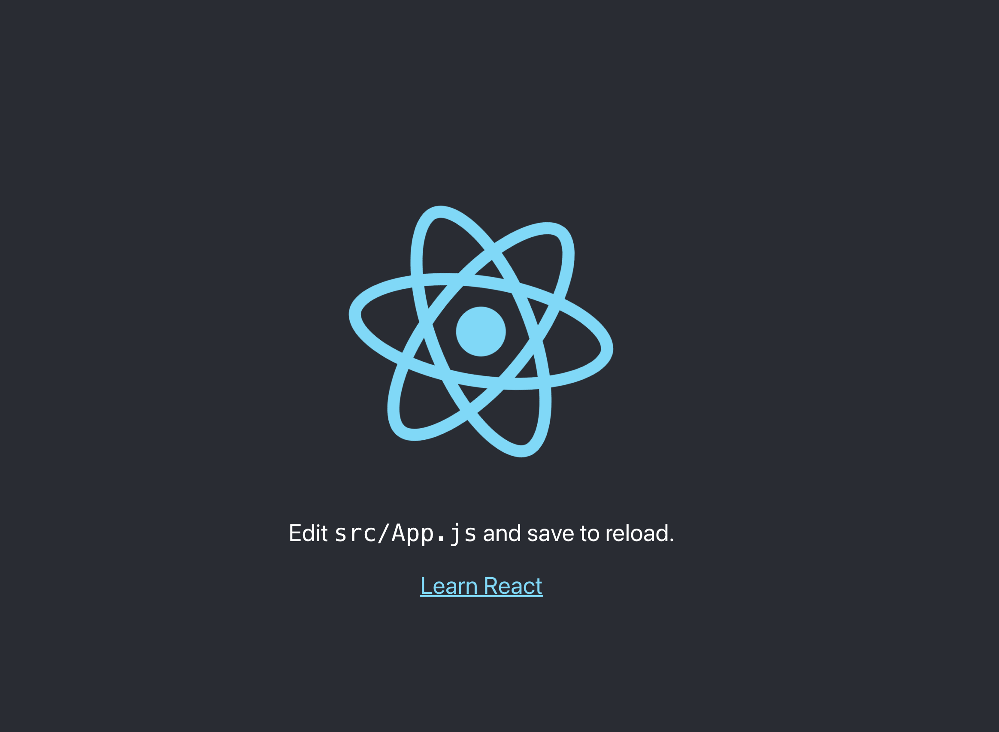

# Build a Resume with React and Static Web Apps

## Objectives

 * Build a resume with React
 * Deploy the resume to Static Web Apps
 * Dive into the code and see how it works
 * Refactor code for API
 * Customize contents for Resume

---

## Tutorial
---

### 1. Create-React-App

Follow [this tutorial](https://create-react-app.dev/docs/getting-started) for a basic React app. This is one of the most common ways to create your basic React app and see that it works.

```
npx create-react-app my-resume
```

The output will end something like this:

```
...
...
Success! Created my-resume at /Users/nitya/Documents/GitHub/nitya/react-resume-swa/my-resume
Inside that directory, you can run several commands:

  npm start
    Starts the development server.

  npm run build
    Bundles the app into static files for production.

  npm test
    Starts the test runner.

  npm run eject
    Removes this tool and copies build dependencies, configuration files
    and scripts into the app directory. If you do this, you can’t go back!

We suggest that you begin by typing:

  cd my-resume
  npm start
```

---

### 2. Preview This App

So let's do that and see what the default app looks like:

```
cd my-resume
npm start

...
Starting the Development Server
Compiled successfully!

You can now view my-resume in the browser.

  Local:            http://localhost:3000
  On Your Network:  http://192.168.86.244:3000

Note that the development build is not optimized.
To create a production build, use npm run build.

webpack compiled successfully
```

`🏁 #1` | **This is what you get**

